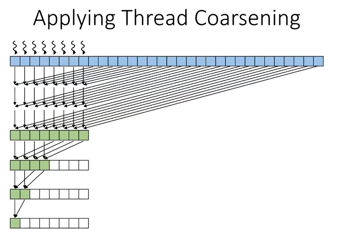
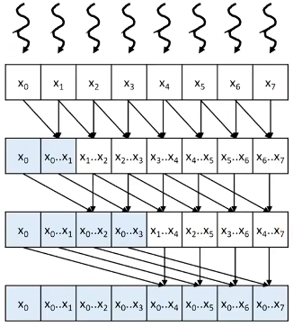
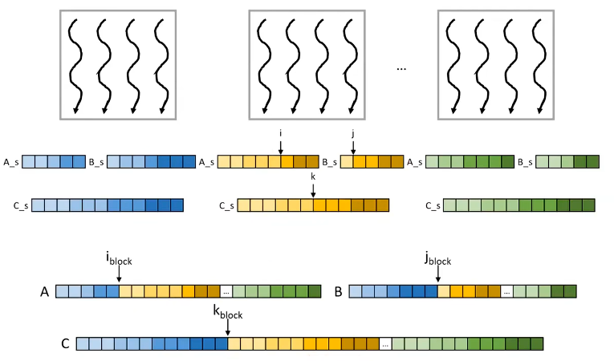
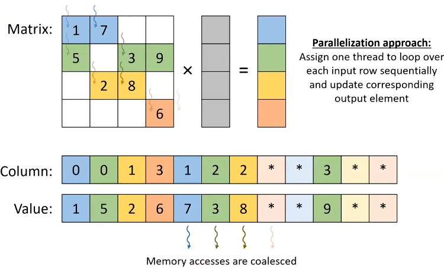
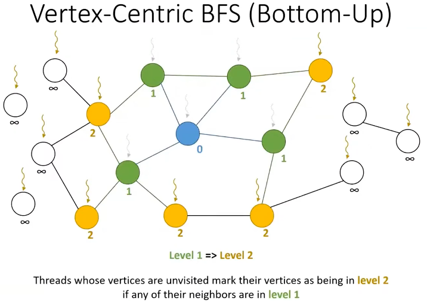
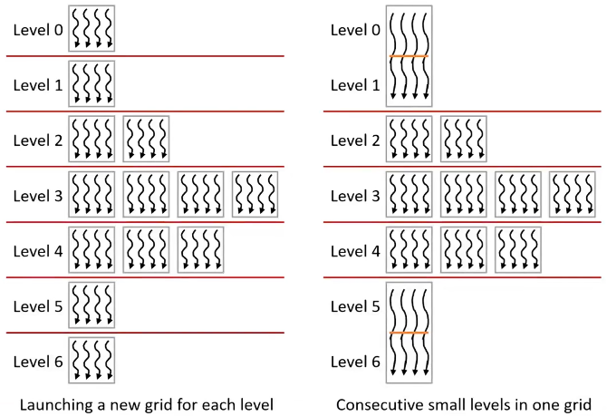
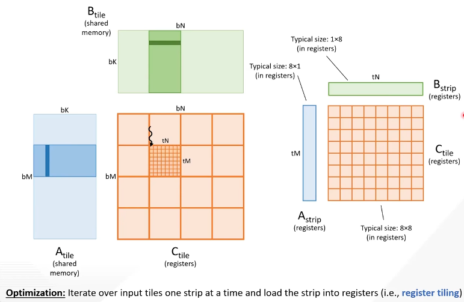

thread coarsening: 

segmented scan: 

Kogge-Stone parallel (inclusive) scan: 

Brent-Kung Parallel (Inclusive) Scan: 

Brent-Kung Parallel (Exclusive) Scan: 

Finding Input Segments: 

Shared Memory Tiling: 

paralleling radix sort: 

optimizing memory coalescing: 

Radix Sort with Thread Coarsening: 

Merge Sort: 

SpMV/COO: 

SpMV/CSR: 

SpMV ELL: 

Hybrid ELL COO: 

SpMV JDS Kernel: 

Vertex-Centric BFS (Top-Down): 

Vertex-Centric BFS (Bottom-Up): 

Edge-Centric BFS: 

Similarity between BFS and SpMV: 

Vertex-Centric Frontier-Based BFS: 

Minimizing Launch Overhead: 

Pipelining Vector Addition: 

Applications of Dynamic Parallism: 

Use Large Tiles: 

Computing Thread Tile: 

Register Tiling: 

Rearranging Tiles to Coalesce Stores: 

Motivation for Software Pipelining: 

alt text: 

alt text: 
