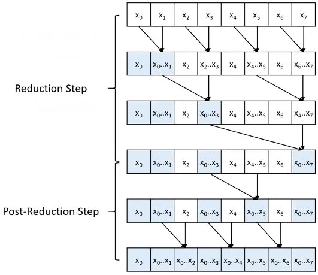
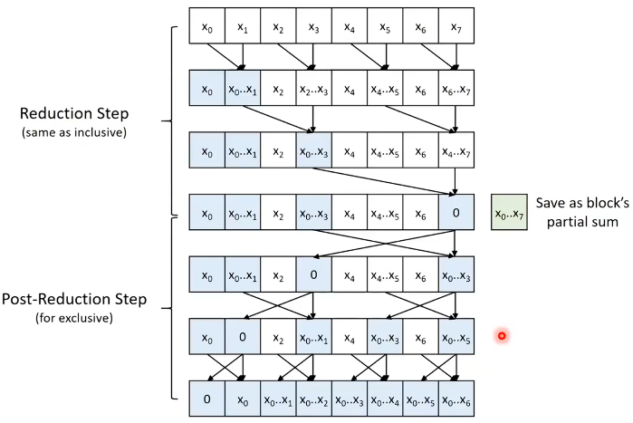

Brent-Kung Parallel (Inclusive) Scan

- using shared memory also enables coalescing (already coalesced in Kogge-Stone)
- no need double-buffering
- control divergence
  - don't assign threads to specific data elements
  - re-index threads on every iteration to different elements
    - reduction: using the right operand as the index
    - post-reduction: using the left operand as the index
    - when stride is $s$, thread $t$ is responsible for element $(t+1) \cdot (2s) - 1$

exclusive scan
- shift elements, or
- different post-reduction step: Brent-Kung Parallel (Exclusive) Scan

Thread Coarsening for scan
- each thread scans a segment sequentially
- only scan the partial sums of each segment in parallel

