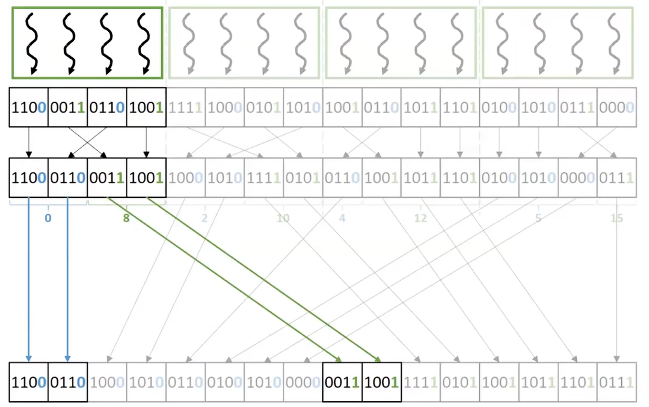
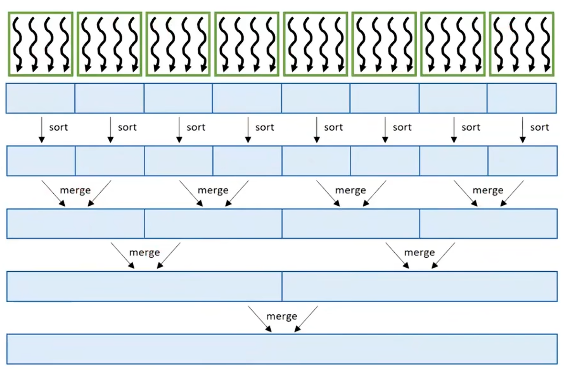

radix sort
- distribute keys into buckets based on a radix (or base)
- distributing keys into buckets is repeated for each digit, while preserving the order from previous iterations
- using a radix that is a power of 2 simplifies processing binary numbers
  - each iteration handles a fixed slice of bits from the keys
- is not a comparison-based sort, so it's not applicable to all kinds of keys

- finding destination index
  - need to find: #ones to the left of each element
    - destination of a zero = element index - #ones to the left
    - destination of a one = input size - #ones in total + #ones to the left
    - use exclusive scan
  - extract bit -> exclusive scan -> destination index -> take and store

stores are not coalesced
- sort locally in shared memory, then write each bucket to global memory in a coalesced manner

choice of radix value
- larger radix
  - advantage: fewer iterations
  - disadvantage: more buckets, results in poorer coalescing

thread coarsening  

merge sort
- divide the list into sublists, sorts the sublists, then merges them (divide and conquer algorithm)

- early steps rely more on parallelism across merge operations
- later steps rely more on parallelism within merge operations
