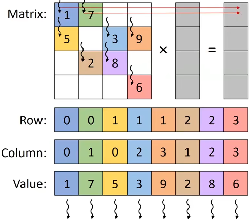

sparse matrices: many elements are zero

opportunities
- do not need to allocate space for zeros (save memory)
- do not need to load zeros (save memory bandwidth)
- do not need to compute with zeros (save computation time)

sparse matrix storage formats
- Coordinate Format (COO)
- Compressed Sparse Row (CSR)
- ELLPACK Format (ELL)
- Jagged Diagonal Storage (JDS)
- ...

format design considerations
- space efficiency (memory consumed)
- flexibility (ease of adding/reordering elements)
- accessibility (ease of finding desired data)
- memory access patterns (enabling coalescing)
- load balance (minimizing control divergence)

case study: sparse matrix-vector multiplication (SpMV)
- the produnct of a sparse matrix and a dense vector

Coordinate Format (COO)
- stores every nonzero along with its row index and column index

SpMV/COO
- assign one thread per nonzero
- multiple threads writing to the same output, need atomic operations
- already coalesced

COO tradeoffs
- advantages
  - flexiblity: easy to add new elements, nonzeros can be stored in any order
  - accessibility: given a nonzero, can easily find its row and column
  - SpMV/COO has coalesced memory access and no control divergence
- disadvantages
  - accessibility: given a row and column, hard to find all nonzeros
  - SpMV/COO requires atomic operations

Compressed Sparse Row (CSR)
- stores nonzeros of the same row adjacently and an index to the first element of each row

SpMV/CSR
- assign one thread per row

CSR tradeoffs
- advantages
  - space efficiency: row pointers smaller than column indices
  - accessibility: given a row, easy to find all nonzeros
  - SpMV/CSR avoids atomics
- disadvantages
  - flexibility: hard to add new elements
  - accessibility: given nonzero, hard to find its row; given a column, hard to find all nonzeros
  - SpMV/CSR has uncoalesced memory access and control divergence

Compressed Sparse Column (CSC): like CSR but groups nonzeros by column
