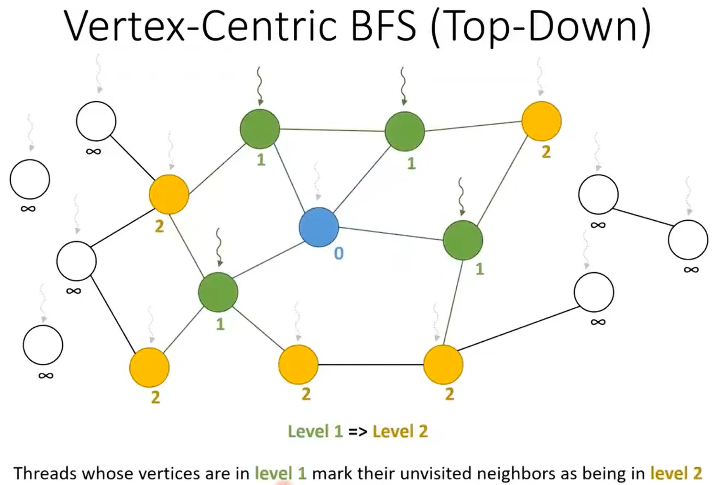
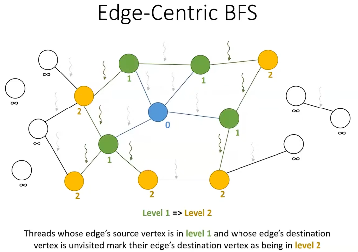
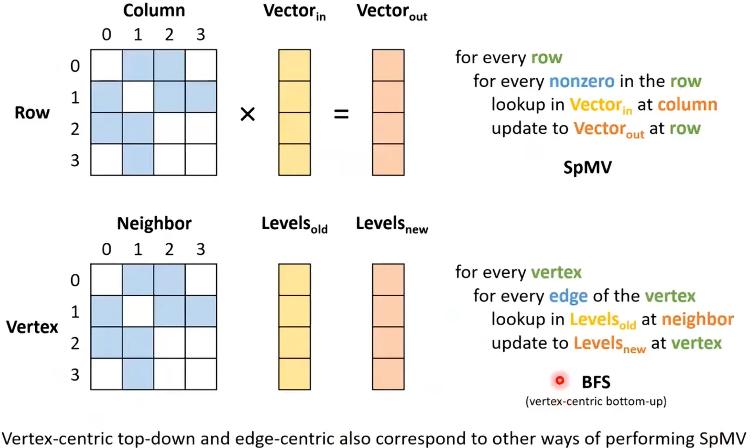

representing graphs: adjacency matrices

focus on
- unweighted graph: 1 for edge, 0 for no edge
- undirected graph: symmetric adjacency matrix

COO and CSR/CSC representations
- COO: array `src`, array `dst`
- CSR and CSC are equivalent because of symmetry: array `srcPtrs`, array `dst`

parallelizing graph processing
- vertex-centric
  - assign a thread to do something for each vertex
  - typically use CSR/CSC (might ELL, JDS, ...) : given a vertex, easy to find its neighbors
- edge-centric
  - assign a thread to do something for each edge
  - typically use COO: given an edge, easy to find its source and destination
- hybrid
  - example: given an edge, need neighbors of its source and destination, need both COO and CSR/CSC
    - triangle counting, k-core decomposition, ...

Breadth First Search (BFS) 
- vertex-centric (2 versions)
  - top-down: for every vertex in the previous level, add all its unvisited neighbors to the current level
    - i.e. assign a thread to every parent vertex in the BFS tree
  - bottom-up: for every vertex, if it has not been visited, if any of its neighbors is in the previous level, add it to the current level
    - i.e. assign a thread to every potential child vertex in the BFS tree
  - direction-optimized: start with top-down then switch to bottom-up
- edge-centric
  - for every edge, if its source was in the previous level, add its destination to the current level

Notice: there should be 2 threads per edge in the image because the graph is undirected, but only show one for simplicity.

Dataset Implications
- the best parallelization approach depends on the structure of the graph
- the vertex-centric bottom-up and edge-centric approaches are better on high-degree graphs
  - e.g. social network graphs with celebrities
  - better at dealing with load imbalance
- the vertex-centric top-down approach is better on low-degree graphs
  - e.g. map of roads in a geographical area
  - can be improved by launching more threads to process neighbors of high-degree vertices

Linear Algebraic Formulation of Graph Problems
- with a few tweaks, BFS can be formulated as SpMV
  - use visited list as input/output vector
  - a few other operations to get wanted
- Many graph problems can be formulated in terms of sparse linear algebra computations
  - advantage: leverage mature and well-optimized parallel libraries for high performance sparse linear algebra
  - disadvantage: not always the most efficient way to solve the problem

Redundant Work
- approaches so far check every vertex/edge on every iteration for relevance
- easy to implement, highly parallel, no synchronization across threads
- weakness: a lot of unnecessary threads/work
  - many threads will find that their vertex/edge is not relevant for this iteration and just exit

