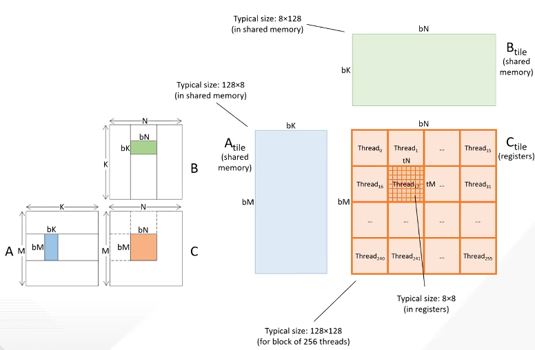
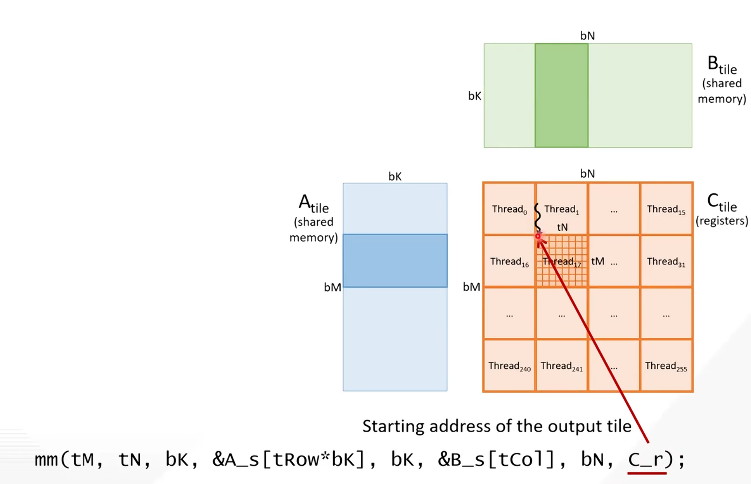
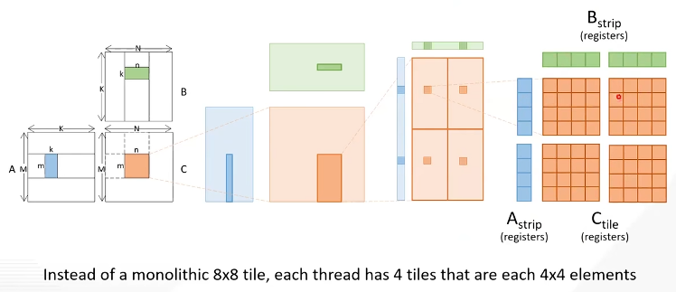
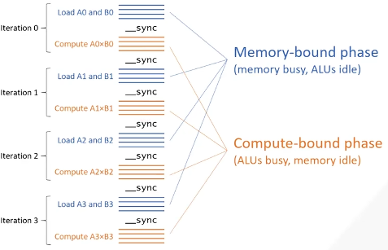

the simple matrix multiplication kernel is memory bound
- arithmetic intensity is 0.25 FLOP/B
- higher in practice due to caches, but still memory bound
but matrix multiplication has the potential to be highly compute bound (so it suits GPU well)
- for $N$-$N$ square matrices, data accessed is $12N^2$ B, operations is $2N^3$ FLOP, so arithmetic intensity is $N/6$ FLOP/B
- h100 approximately 20 FLOP/B

review: tiled matrix-matrix multiplication
- input in shared memory, output in registers
- for $n$-$n$ square tiles (ignore storage), ($2n^3$ FLOP) / ($8n^2$ B) = $0.25n$ FLOP/B, $8$ FLOP/B for $n=32$
- increasing $n$

Let the tiles of A, B, C have size $m\cdot k$, $k\cdot n$, $m\cdot n$
- arithmetic intensity: $(mn)(k\text{ adds}+k\text{ muls})/((mk+kn\text{ values})(4\text{ B})) = 0.5mn / (m+n)$ FLOP/B
- increasing $m$ and $n$ increases reuse ratio, keeping $k$ small prevents increasing demand on shared memory, but stress on registers
- typically use $m=n=128$, $k=8$, achieving 32 FLOP/B, $k$ not too small to utilize caches
  - use 256 threads per block, 8x8 elements per thread

By default, local memory arrays are placed in the global memory
  - with loop unrolling, variable indices are converted to constant indices which allows the compiler to promote the arrays to registers
  - e.g. `__forceinline__` with `#pragma unroll`

additional optimizations
- vector loads/stores: improve global memory bandwidth utilization
  - each thread issues 1 vector load which loads consecutive 16B (4 elements)
  - advantage: fewer loads/stores instructions, better store coalescing
- register tiling: reduce shared memory access latency
  - iterating over input tiles one strip at a time and load the strip into registers
- coalescing stores: improve global memory bandwidth utilization
  - rearrange tiles: divide to 4 quadrants
- eliminating bank conflicts: reduce shared memory access latency
  - avoid multiple threads accessing the same bank of shared memory at the same time
  - add padding (A tile), already avoided by rearranging (B tile)
- software pipelining: improve latency tolerance
  - advanded matrix multiplication kernels usually have low occupancy due to high register usage (register tiling of output tile and input strips, aggressive loop unrolling and instruction scheduling)
  - each thread may use up to the maximum allowed 255 registers/thread, with 64k registers/SM, that limits occupancy to 256 threads/SM, 12.5% of the maximum 2048 threads/SM
  - drawback of low occupancy: fewer warps to hide core and memory latency
  - alternative optimizations for hiding latency to compensate for low occupancy
    - loop unrolling already helps hide core latency
    - vector loads/stores help hide memory latency
    - software pipelining and warp specialization
  - all iterations have memory-bound phases and compute-bound phases, but there are no other blocks on the SM to tolerate the phase behavior
  - true and false dependencies by synchronization
  - software pipelining: rearrange loop so that compiler can overlap a tile with loading the next tile
  - apply warp specialization: allows hardware to interleave the compute and memory instructions from different warps dynamically
- using specialized hardware units
  - tensor memory accelerator (TMA): asynchronous copy engine between global and shared memory
    - avoids busying cores with instructions for copying data
    - avoids using registers for copying data from global to shared memory
  - tensor cores: perform small matrix multiplications
    - typically use in cuBLAS and CUTLASS

