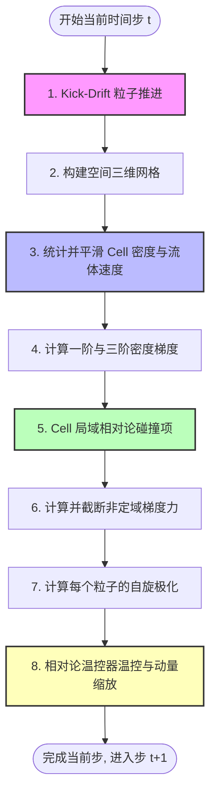

# 夸克胶子等离子体（QGP）输运与自旋极化 CUDA 模拟技术指南

本指南详细介绍了基于 GPU (CUDA) 架构的相对论性 QGP 输运与自旋极化数值模拟程序的物理原理、代码结构和时间步迭代工作流。

---

## 1. 物理原理与数学模型

本项目在微观上采用**测试粒子方法**（Test Particle Method）求解相对论性 Boltzmann-Vlasov 方程：
$$ \left( p^\mu \partial_\mu + m \mathbf{F}^\mu \frac{\partial}{\partial p^\mu} \right) f(x, p) = \mathcal{C}[f] $$
其中 $f(x, p)$ 为夸克的相空间分布函数，$\mathbf{F}^\mu$ 为非定域势场力，$\mathcal{C}[f]$ 为相对论性两体碰撞项。

### 1.1 相对论性运动学
每个粒子拥有位置 $\mathbf{x}_i$ 和动量 $\mathbf{p}_i$。其四维动量满足质壳条件：
$$ E_i = \sqrt{\mathbf{p}_i^2 + m^2} $$
其中 $m = 0.5 \text{ GeV}$ 为有效热质量。粒子速度表示为：
$$ \mathbf{v}_i = \frac{\mathbf{p}_i}{E_i} $$

### 1.2 非定域界面效应势场（Vlasov 力）
为了模拟 QGP 相变与气液共存的液滴边界效应，我们引入了非定域势的多级展开力场：
$$ \mathbf{F}_{NL} = 2a\nabla n - c_2 \nabla(\nabla^2 n) $$
*   **范德华吸引项 ($2a\nabla n$)**：参数 $a$ 驱动粒子发生局域聚集（相分离）。
*   **表面张力项 ($-c_2 \nabla(\nabla^2 n)$)**：二阶拉普拉斯梯度项阻止高频色散，稳定液滴边界。

### 1.3 相对论两体弹性碰撞项
我们采用局域网格内的随机冲突试验法（Stochastic Collision Method）模拟弹性散射 $\mathcal{C}[f]$。在同一个空间单元（Cell）内，粒子两两碰撞的概率取决于其相对速度 $v_{rel}$ 和碰撞截面 $\sigma$：
$$ P_{coll} = \frac{\sigma \cdot v_{rel} \cdot \Delta t}{V_{cell}} $$
碰撞后的动量在质心系中各向同性各向随机散射，并满足相对论动量与能量守恒。

### 1.4 自旋极化微观公式
超子的极化向量 $\mathbf{S}_i$ 受到热涡旋 $\boldsymbol{\omega}$、剪切张量 $\boldsymbol{\Sigma}$ 和非定域有效梯度 $\mathbf{g}_{eff}$ 的共同贡献：
$$ \mathbf{S}_i = C_\omega \boldsymbol{\omega} + C_{shear} \mathbf{v}_i \cdot \boldsymbol{\Sigma} + C_g (\mathbf{v}_i \times \mathbf{g}_{eff}) $$
其中在相边界区，有效梯度包含拉普拉斯修正项，从而能提供解释极化符号反转的物理机制：
$$ \mathbf{g}_{eff} = \nabla n - \lambda \nabla(\nabla^2 n) $$

---

## 2. CUDA 代码架构与文件分布

项目采用头文件模块化设计，将物理计算逻辑按功能分拆并部署在 GPU 不同的核函数（Kernel）中：

```
QGP_MC/
├── src/
│   ├── main.cu                # 主程序（主循环、内存管理、I/O）
│   └── include/
│       ├── common.cuh         # 基础数据结构（Particle, Cell）与全局参数配置
│       ├── kinematics.cuh     # 相对论性运动学计算辅助函数
│       ├── gradients.cuh      # 3D网格密度平滑及一阶、三阶梯度计算核函数
│       ├── forces.cuh         # 非定域力计算与幅值截断控制
│       ├── collisions.cuh     # 相对论弹性碰撞项（Cell级随机冲突）
│       └── polarization.cuh   # 流体涡旋、剪切和梯度耦合自旋极化核函数
├── visualize_qgp.py           # 自动化编译、模拟、投影与绘图分析脚本
└── README_CN.md               # 中文参考指南
```

### 2.1 核心头文件设计物理功能说明

1.  **[common.cuh](file:///c:/Users/hy-wu.DESKTOP-G355NC5/Documents/GitHub/notes/QGP_MC/src/include/common.cuh)**
    *   定义了结构体 `Particle`，包含粒子的位置 `pos`、动量 `mom`、能量 `E`、自旋极化向量 `pol` 等。
    *   定义了网格信息 `Cell`，用于收集网格内的平均速度和流体性质。
2.  **[kinematics.cuh](file:///c:/Users/hy-wu.DESKTOP-G355NC5/Documents/GitHub/notes/QGP_MC/src/include/kinematics.cuh)**
    *   定义了相对论速度转换及四维动量的数学操作（如 `length`，动量点乘等）。
3.  **[gradients.cuh](file:///c:/Users/hy-wu.DESKTOP-G355NC5/Documents/GitHub/notes/QGP_MC/src/include/gradients.cuh)**
    *   `smooth_density_kernel`：使用三维 7 点拉普拉斯算子对密度场进行平滑去噪，有效压制三阶导数放大泊松噪声的问题。
    *   `compute_gradients_kernel`：计算一阶梯度 $\nabla n$ 和三阶梯度 $\nabla(\nabla^2 n)$ 并存入网格中。
4.  **[forces.cuh](file:///c:/Users/hy-wu.DESKTOP-G355NC5/Documents/GitHub/notes/QGP_MC/src/include/forces.cuh)**
    *   `apply_non_local_forces_kernel`：将网格中的密度梯度映射回粒子，计算每个粒子受到的势场力并进行上限截断（Force Capping）防止过大脉冲。
5.  **[collisions.cuh](file:///c:/Users/hy-wu.DESKTOP-G355NC5/Documents/GitHub/notes/QGP_MC/src/include/collisions.cuh)**
    *   `collide_particles_kernel`：在每个空间单元内，通过随机配对进行碰撞几率测试。若是，执行 Lorentz 变换到两粒子质心系、各向同性旋转动量、再逆变换回实验室系。
6.  **[polarization.cuh](file:///c:/Users/hy-wu.DESKTOP-G355NC5/Documents/GitHub/notes/QGP_MC/src/include/polarization.cuh)**
    *   `calculate_polarization_kernel`：基于粒子当前速度、所处单元的旋度 $\boldsymbol{\omega}$、剪切变形张量 $\boldsymbol{\Sigma}$ 以及局域有效非定域梯度 $\mathbf{g}_{eff}$ 求解三维自旋极化分量。

---

## 3. 时步迭代算法流程与数据流

每个时间步（Time Step）更新时，GPU 端的数据处理流程如下：



### 3.1 核心步流程详细说明

1.  **粒子推移 (Kick-Drift)：**
    使用前一步计算的势场力 $F_{NL}$ 推动粒子更新动量，然后根据相对论速度 $\mathbf{v} = \mathbf{p}/E$ 移动粒子位置。若越过边界则进行反射或回弹处理。
2.  **网格归属计数：**
    计算每个粒子的空间坐标对应的网格索引 `cell_idx`，以原子加锁操作（`atomicAdd`）累加各个 Cell 内的粒子数密度以及三维流速。
3.  **密度平滑与去噪：**
    调用 `smooth_density_kernel` 对网格中的数密度场进行平滑。通过 $3$ 次迭代，滤除泊松噪声对高阶空间微分（三阶导数）的指数级放大作用。
4.  **梯度提取：**
    利用中心差分格式，在三维网格上计算密度梯度 $\nabla n$ 和拉普拉斯算子梯度 $\nabla(\nabla^2 n)$。
5.  **局域弹性碰撞：**
    调用 `collide_particles_kernel`。每个网格单元内粒子被随机分组并完成局域相对论弹性散射，保证动量与能量严格守恒。
6.  **计算非定域势场力：**
    将一阶和三阶网格梯度插值回每个粒子上，计算其受到的力并更新有力数组 `forces`，供下一个时间步推移使用。
7.  **自旋极化计算：**
    网格流速的旋度与剪切率和粒子速度相互耦合，更新自旋极化分量。
8.  **温控器（Thermostat）动量缩放：**
    统计系统总动能，使用插值相对论指数缩放公式，将动量向设定温度 $T_{target}=0.3 \text{ GeV}$ 进行全局缩放，维持系统温度的稳定性。
